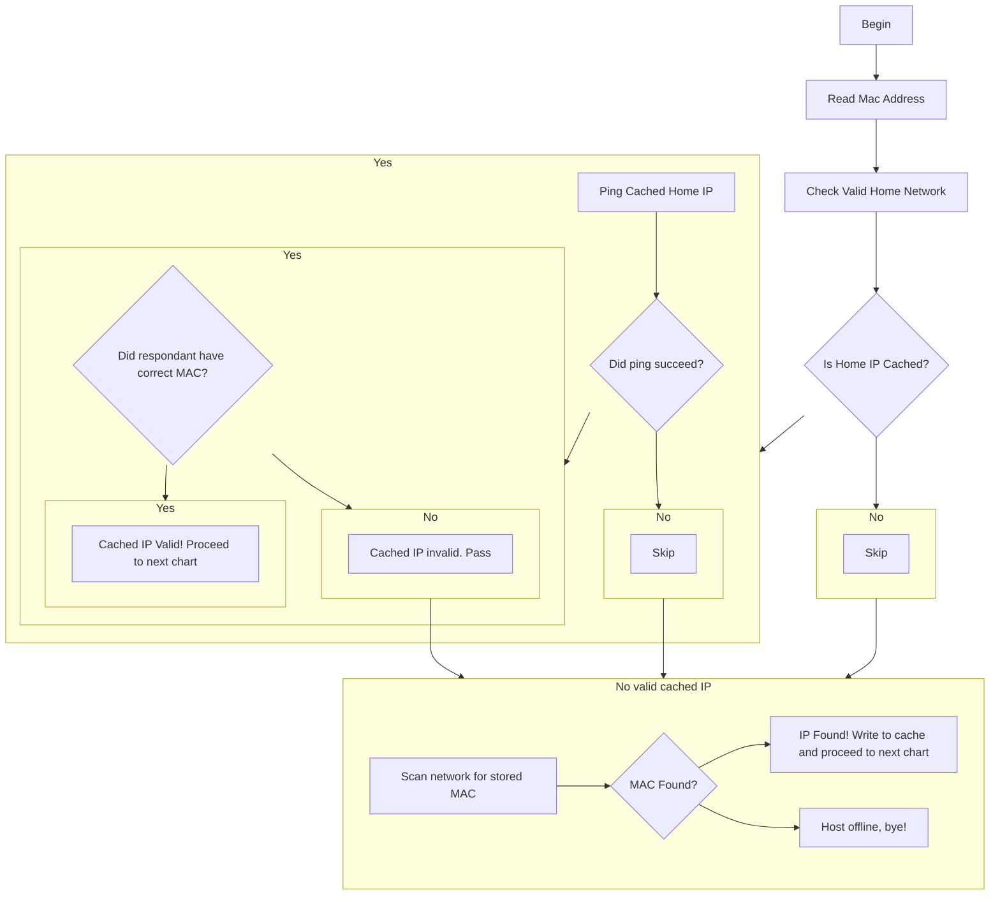
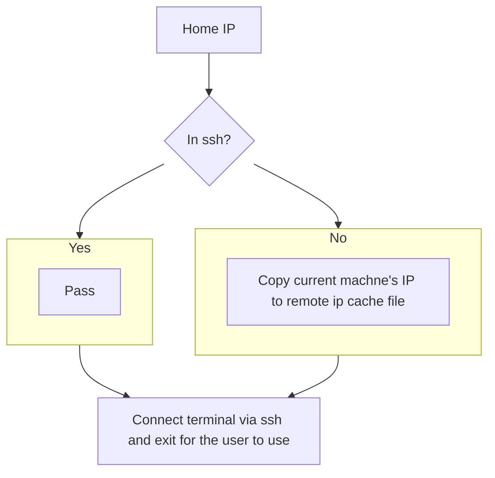

# Remote Home
I am at a place that has a geographically large WiFi network. As such, I sometimes end up separated from my two computers, and find myself in need of files from the other laptop. 

Since I usually leave them on and connected to the network, I was able to write the scripts in this repository to rapidly connect the two physically separated laptops.

These scripts are not miracles, they just allow for a streamlined connection from one machine to the other via `ssh`. This is **NOT** remote desktop, and recommended to the terminally ~~ill~~ advanced out there. 

This does **NOT** support windows, but I imagine a simple translation from bash to batch would we sufficient.

## Usage
This process is slightly involved. Requires two machines, and each step to be completed on both machines before moving to the next step. 

0. Install and enable ssh server, create ssh key

```bash
sudo apt install openssh-server
sudo systemctl enable ssh
sudo systemctl start ssh
ssh-keygen -t rsa -b 4096
```

1. Copy ssh key to other device. This assumes they have the same username which will make everything easier.

```bash
# if you know your ip, you can replace the $() with that ip
ssh-copy-id $(whoami)@$(ifconfig | grep -Eo 'inet (addr:)?([0-9]*\.){3}[0-9]*' | grep -Eo '([0-9]*\.){3}[0-9]*' | grep -v '127.0.0.1')
```

2. Disable password authentication. This will force ssh to use the keys we just created. (Not required, but highly recommended especially if this is not your private home network)

```bash
# We need to uncomment and change PasswordAuthentication yes to no
sudo nano /etc/ssh/sshd_config
# restart server
sudo systemctl restart ssh
```

3. Configure scripts.

```bash
# replace <homemacaddress> with the OTHER machine's mac address
echo <homemacaddress> > ~/.homemac
echo $(iwgetid -r) > ~/.homenet
```

4. Phone home! 

```bash
./phonehome
```

### Extra steps
You can and should add the folder with these scripts to your path. I will not tell you how to do that since you may have your own way.

### How it works
These scripts work in the following way. They first attempt to find out the IP address of the other machine and verify that the MAC and IP agree:



Once that has happened, the connection and handshake happens



Tada! Magic.